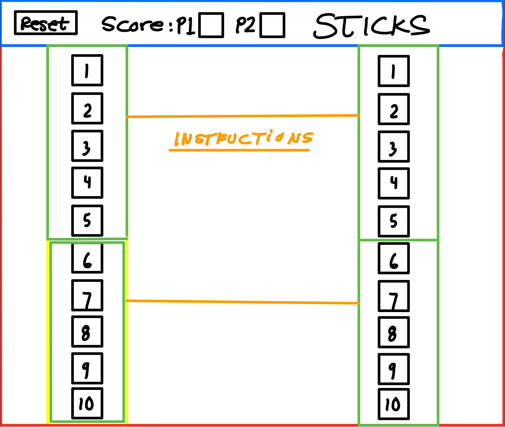

# Project1 - Sticks

---

### Game Description
<!-- Game Description -->

sticks is a game that I played when I was younger. it consists of two players. To start the game both player need to use both hands and stick out there pointer 
fingers. The role of the fingers it to be markers. When player 1 starts they use their pointer finger to hit player 2's finger and then player 2 has to put up another finger on the hand that was hit. Then player 2 can choose between hitting player 1 with the 2 fingers on one hand or the one finger on the other. If player 2 hits player 1 with the 2 fingers they have up then player 1 has to add 2 fingers to the hand that got hit, and so on.

---

### Tech Going to be Used
<!-- Using DOM  -->

I will be using DOM manipulation in order to make this game since there wont be any rendering needed to make the game.

```
document.querySelector('#player1Left2').style.display = 'none';
let p1L1 = document.querySelector('#player1Left1').addEventListener('click', showLeft2)
```
This code was used to call the buttons I made in the HTML file. I made the click start with the first button so that another button would appear like someone putting up a finger. I did this for all ten fingers for each player.

```
function showLeft2 (e) {
    countp1LeftHand++
    document.querySelector('#player1Left2').style.display = 'block';
    e.preventDefault();
}
```

This function was to make the second button appear when the firstbutton was clicked. I did this for the buttons 2-4 on each hand. I also add a count for click. (when each button was clicked)

```
function showLeft5 (e) {
    countp1LeftHand++
    document.querySelector('#player1Left5').style.display = 'block';
    e.preventDefault()
    if (countp1LeftHand >= 4){
        document.querySelector('#player1Left1').style.display = 'none';
        document.querySelector('#player1Left2').style.display = 'none';
        document.querySelector('#player1Left3').style.display = 'none';
        document.querySelector('#player1Left4').style.display = 'none';
        document.querySelector('#player1Left5').style.display = 'none';
    }
    displayWinner()
}
```

with the 5 function, I added an if statement in order to count the number of clicks on each players hands in order to make the buttons disappear when a player reached four or more clicks. I called the funtion displayWinner in oder to display winner.

```
function displayWinner () {
    if (countp1LeftHand && countp1RightHand >= 4) {
        disp.innerText = "Winner: Player 2"
    }else if (countp2LeftHand && countp2RightHand >= 4){
        disp.innerText = "Winner: Player 1"
    }
}
```

This function has a conditional that displays a winner based on the number of clicks each player had taken. 


---

### Wireframes
<!-- Wireframe -->





---

### MVPs
1. To make a game two player
1. To be able to point out winner 
1. Restart button
1. clickable divs/buttons
1. able to remove divs based on if "hand" has all fingers up.

---

### Stretch Goals
 1. Be able to make the hands comback if player decides to split fingers 
 1. make it more than two player.
 1. allow the game to add more buttons on a click based on how many a player has.
 1. make an AI to play against


 ### Deployable Game
 https://xxmark10xx.github.io/Project1/

 ### Resources
1. Google Fonts
1. MDN and W3Schools


